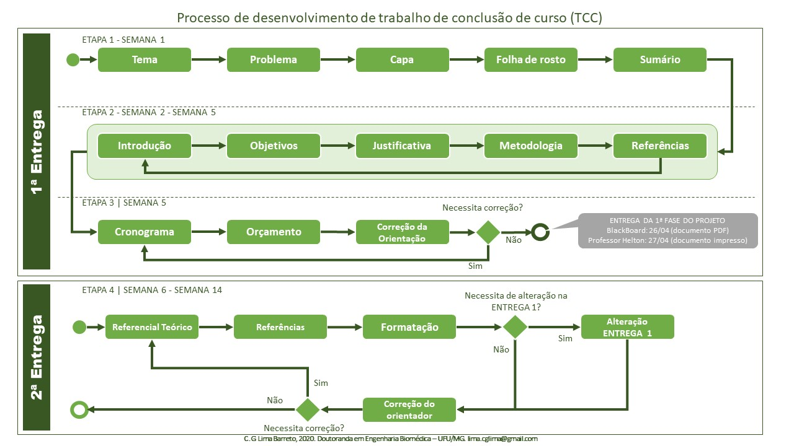

# Como fazer seu Projeto de TCC em 14 semanas

> *Oi Ciana. Eu queria sua ajuda, pois não faço ideia do que fazer.O tema eu já escolhi, mas não sei por onde começar. Tô completamente perdida!*

Tá, primeiro passo: **LEIA** o material que o professor disponibilizou.

* ["Manual para apresentação de Trabalhos de Conclusão de Cursos – TCC"](http://biblioteca.site.unipac.br/wp-content/uploads/sites/16/2019/07/Manual_TCC-2017_ATUALIZADO.pdf)
* ["ESQUELETO PROJETO TCC I_2019"](files/esqueleto-projeto-tcc-i-2019.doc).
  
Após a leitura desse material, você já vai ter uma boa ideia de como preparar seu trabalho. Leia também as dicas que eu postarei nesse site. Por exemplo, o material que eu disponibilizei de [como fazer a introdução](como-fazer-a-introducao.md).

Devemos começar um projeto de TCC pensando no tema (já fez isso?) e fazer uma pergunta a ser respondida relacionada ao tema escolhido.

A partir daí, você vai buscar artigos e referências que te ajudam a responder esta pergunta.

E agora? Agora considerando o tempo que nós temos, você segue o seguinte processo.

Parece complicado? Não se preocupe. Falaremos mais desse processo no decorrer do nosso curso.

Fazer um trabalho como um TCC pode parecer complexo, mas é muito simples se dividirmos o trabalho em pequenas partes.

Por enquanto, concentre-se na primeira etapa.

Até mais e bom trabalho!

[Voltar para página Inicial](index.md)
